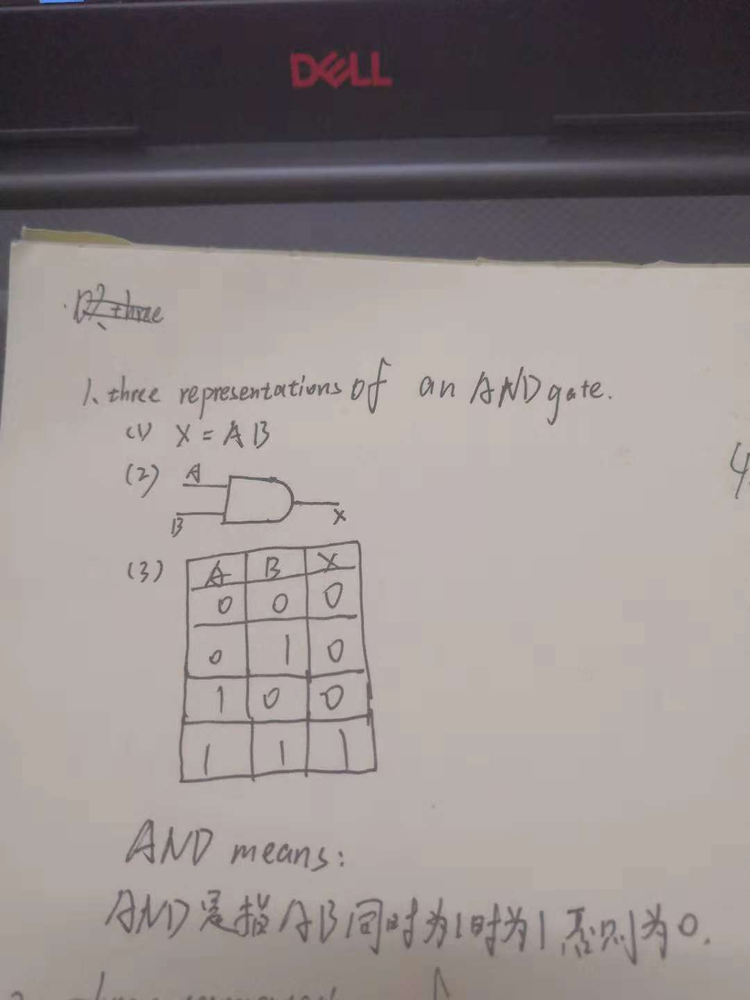
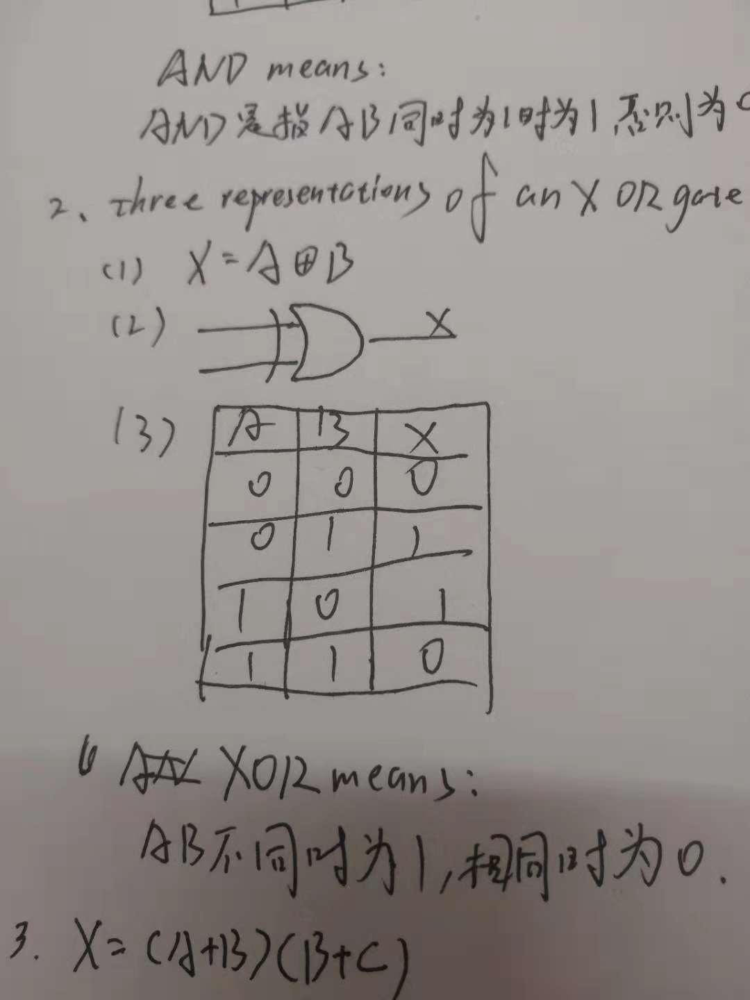
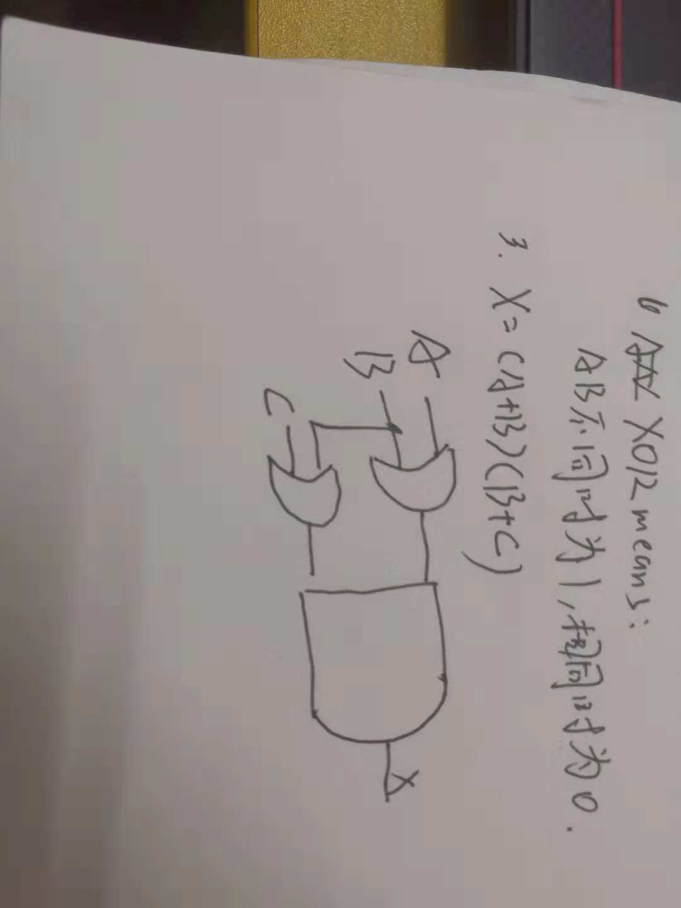
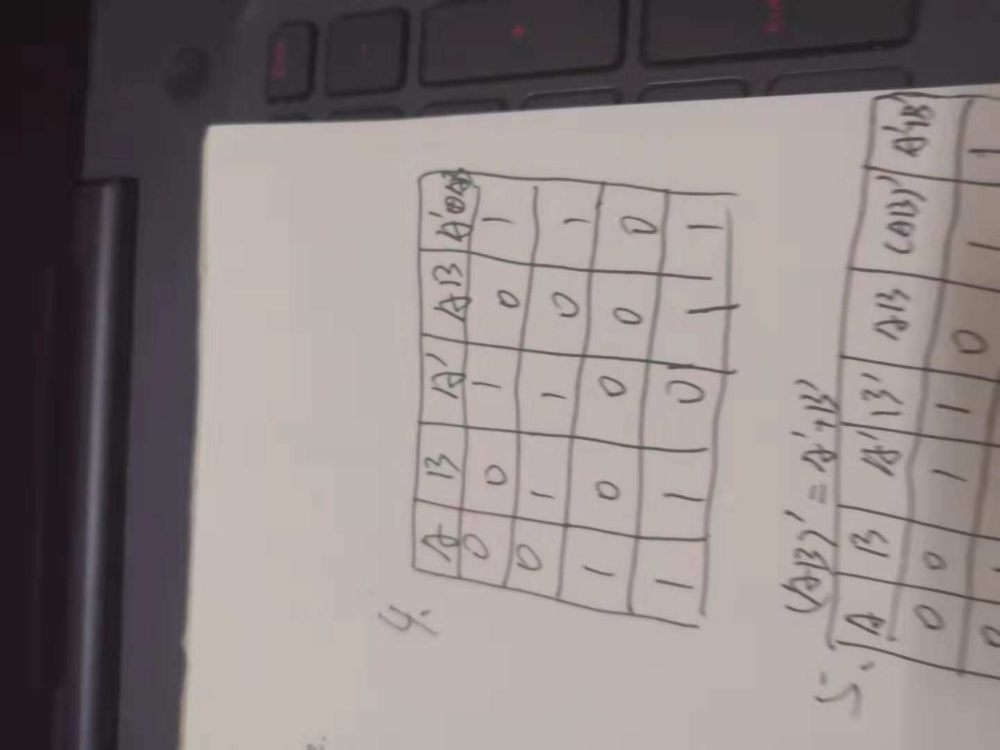
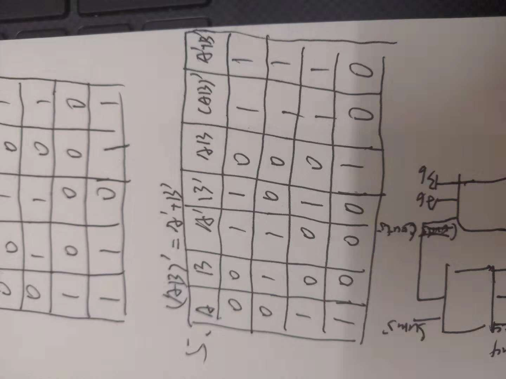
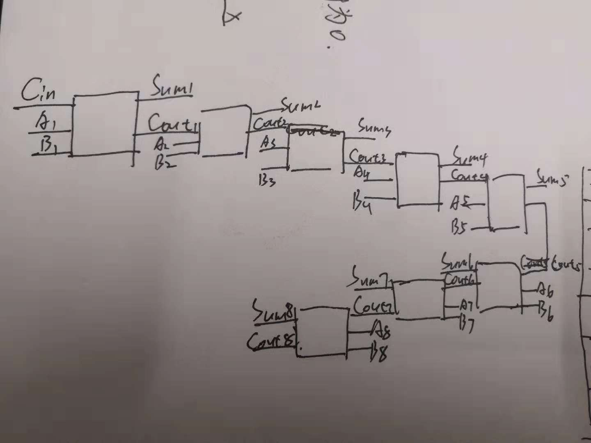
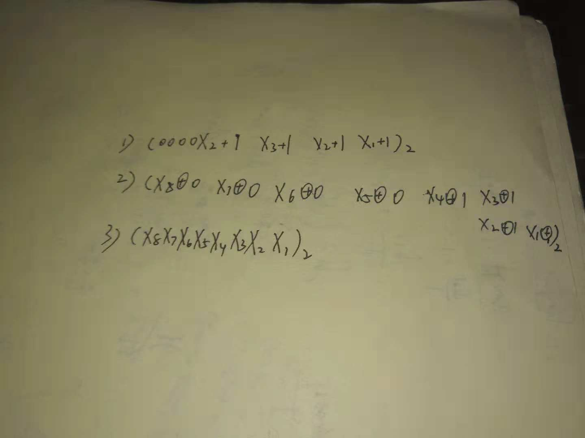

## part 1 and 2
***
1)

2 )

3 )

4 )

5 )

6 )

7 )

## part 3
***
# 维基百科
**1)Logic gate**：

In electronics, a logic gate is an idealized or physical device implementing a Boolean function; that is, it performs a logical operation on one or more binary inputs and produces a single binary output. Depending on the context, the term may refer to an ideal logic gate, one that has for instance zero rise time and unlimited fan-out, or it may refer to a non-ideal physical device在电子学中，逻辑门是实现布尔函数的理想化或物理设备；即，它对一个或多个二进制输入执行逻辑操作并产生单个二进制输出。根据上下文，术语可以指理想逻辑门，例如具有零上升时间和无限扇出的逻辑门，或者它可以指非理想物理设备。 

**2）Boolean algebra：**

In mathematics and mathematical logic, Boolean algebra is the branch of algebra in which the values of the variables are the truth values true and false, usually denoted 1 and 0 respectively. Instead of elementary algebra where the values of the variables are numbers, and the prime operations are addition and multiplication, the main operations of Boolean algebra are the conjunction and denoted as ∧, the disjunction or denoted as ∨, and the negation not denoted as ¬. It is thus a formalism for describing logical relations in the same way that elementary algebra describes numeric relations. 
在数学和数学逻辑中，布尔代数是代数的分支，其中变量的值是真值true和false，通常分别表示1和0。布尔代数的主要运算不是初等代数，其中变量的值是数，素运算是加法和乘法，而是连接和记为，析出或记为，和否定不记为。因此，它是以基本代数描述数值关系的方式描述逻辑关系的形式主义。 

# 二）
中文翻译：触发器。

**How many bits information does a SR latch store?**

only one
