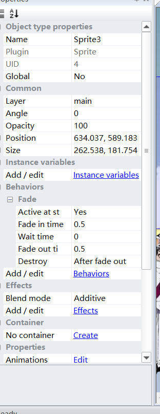
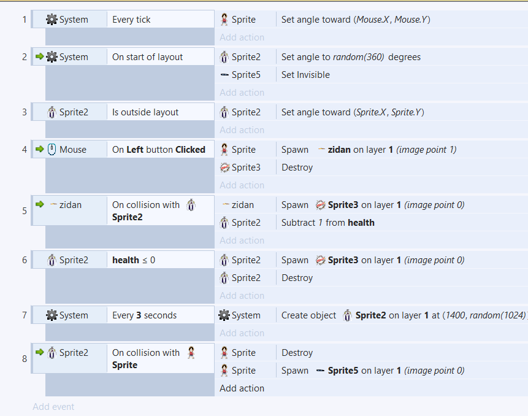
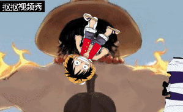

# 用construct制作小游戏
## 首先，准备好所要编辑的图形素材
例如：

***
## 插入图形元素

点击图形元素后，会在左侧出现图示编译器，点击编译器中的behavior，根据自己的需要给各个元素添加对应的动作。
同时，也可以进行速度等元素的设置
***
## 背景添加
好的，现在我们要添加更多对象。但是，我们会不小心选择平铺的背景，除非我们锁定它，使其无法选择。让我们使用分层系统来做到这一点。

布局可以包含多个图层，您可以使用这些图层对对象进行分组。想象一下像玻璃板堆叠在一起的层，每个板上都涂有物体。它允许您轻松地排列哪些对象出现在其他对象之上，并且可以隐藏，锁定图层，应用视差效果等等。例如，在这个游戏中，我们希望所有内容都显示在平铺背景之上，因此我们可以在其他对象的顶部创建另一个图层。

要管理图层，请单击“ 图层”选项卡，该选项卡通常位于“ 项目”栏旁边：

您应该在列表中看到第0层（构造2从零开始计数，因为它在编程时效果更好）。单击铅笔图标并将其重命名为Background，因为它是我们的背景图层。现在单击绿色的“添加”图标为我们的其他对象添加新图层。我们称之为一个Main。最后，如果单击“ 背景”旁边的小挂锁图标，它将被锁定。这意味着您将无法选择任何内容。这对我们的平铺背景非常方便，这很容易被意外选择，不需要再次触摸。但是，如果您需要进行更改，只需再次单击挂锁即可解锁。
***
## 动作添加
在设置完背景之后，我们需要打开event sheet 1栏，给图形添加他们的特性和动作，我们在制作本次游戏中用到的动作主要有：
- 8方向运动。这使您可以使用箭头键移动对象。它会很好地适应玩家的运动。
- 子弹运动。这只是以当前角度向前移动一个物体。它对玩家的子弹很有用。尽管有这个名字，它也可以很好地移动怪物 - 因为所有的移动都是以某种速度向前移动物体。
- 滚动到。这使得屏幕在移动时跟随对象（也称为滚动）。这对玩家有用。
- 绑定到布局。这将停止一个物体离开布局区域。这对玩家也很有用，所以他们不能在游戏区域外游荡！
- 破坏外部布局。而不是停止离开布局区域的对象，如果它停止，则会破坏它。它对我们的子弹很有用。没有它，子弹将永远飞离屏幕，总是占用一点内存和处理能力。相反，我们应该在他们离开布局后销毁子弹。
- 淡出。这逐渐使物体淡出，我们将用于爆炸。

待完成到如图所示的步骤后，即可开始游戏

***
## 具体测试

