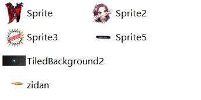
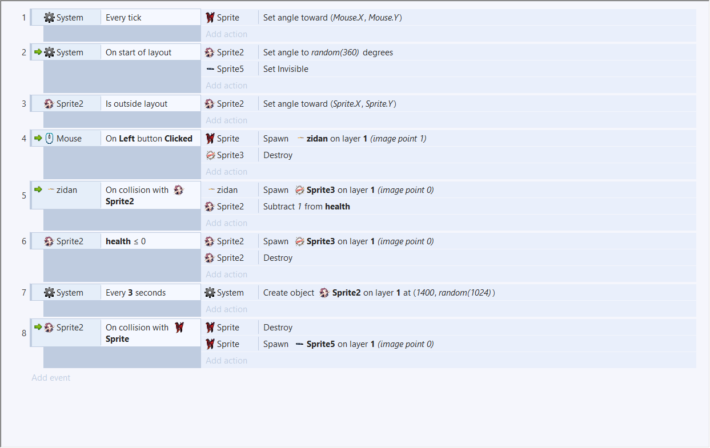
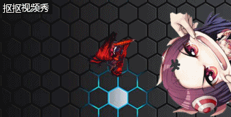

# 游戏制作
## 游戏的策划
首先，我们确定要制作一个射击类游戏，因此，我们需要考虑的就有玩家控制的角色，子弹的射出，怪物的移动，怪物的血量，怪物与子弹的碰撞，以及怪物与角色碰撞后的死亡画面。
***
所以我们先插入各个对应的

元素：

这样我们就有了制作游戏中需要的元素；然后我们需要在对每一个元素制定他的动作

这样我们就有了基本的游戏元素，便可以进行游戏运行试玩一下。

***
# 游戏设计
Object：Sprite

Attribute：图片，属性

Collaborator：移动&发射子弹
***

Object：Sprite2

Attribute：图片，属性

Collaborator：移动&随机出现&碰撞&销毁自己&生命值
***
Object：Sprite3

Attribute：图片，属性

Collaborator：出现&销毁自己
***
Object：Sprite5

Attribute：图片，属性

Collaborator：出现
***
Object：zidan

Attribute：图片，属性

Collaborator：碰撞&销毁自己
***

